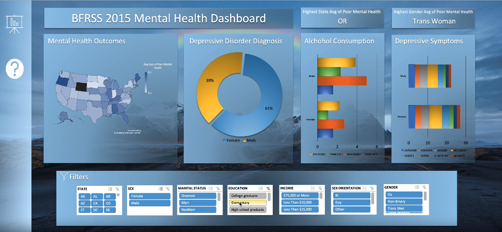

# sexual-gender-minority

## Project Desription
- In this project, I used the [The Behavioral Risk Factor Surveillance System (BRFSS) 2015](https://www.kaggle.com/datasets/cdc/behavioral-risk-factor-surveillance-system) survey dataset on Kaggle to create a dashboard based around the mental health of indivdiuals that identify as sexual and gender minorities.

- 
